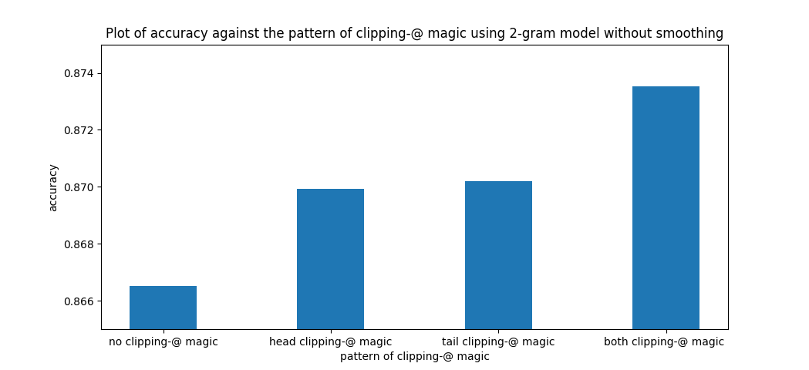
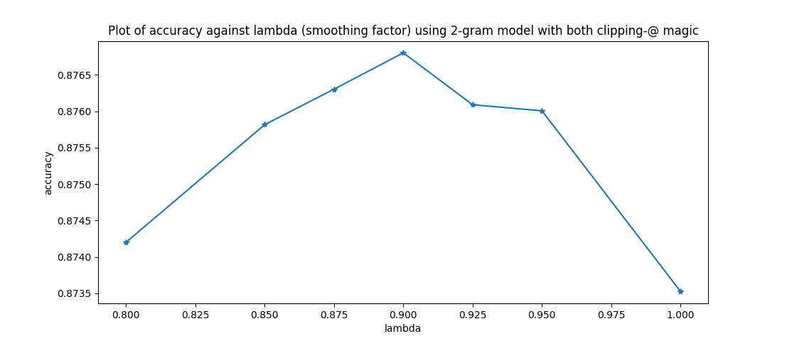
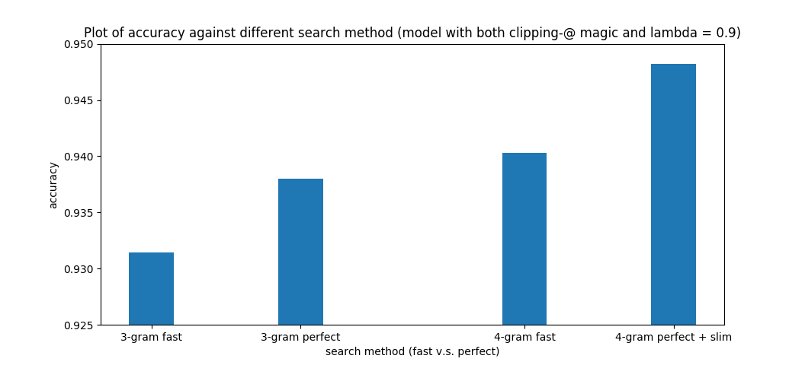

# 拼音输入法作业

## 介绍

输入拼音，输出汉字。
```
pinyin/src$ python main.py --load-model ../model/model.pkl 
qing hua da xue
清华大学
```
详见[这里](https://github.com/siahuat0727/PinYin/blob/master/拼音输入法编程作业.pdf)。

**提供**
1. 训练语料文件夹 `training_data/sina_new_gbk/`：2016年**新浪新闻**部分内容。（约 4 亿字）
2. `training_data/拼音汉字表.txt` ：拼音汉字映射表。e.g. `a 啊 嗄 腌 吖 阿 锕`
3. `training_data/一二级汉字表.txt`：汉字表。e.g. `啊阿埃挨哎唉哀皑癌蔼矮艾碍爱...`

**测试**
1. 测试文字（答案） `testing_data/news.txt`：[爬虫教学](https://blog.csdn.net/qq_33722172/article/details/82469050)爬近期新浪新闻+预处理。（约 8 万字）
2. 测试拼音（题目）`testing_data/input.txt`：[汉字拼音在线转换](https://www.qqxiuzi.cn/zh/pinyin/)+预处理。
3. 准确率计算：逐字计算。


**代码功能**（均通过命令行参数）
1. 只要资源允许，可训练**任意** n 元字模型（n>=2）。
2. 可依据需求在准确率和速度上做出相应的折中（简化版DP，完整版DP，加速×简化版DP，加速×完整版DP）。

**成果**
1. `testing_data/predict.txt`：4 元加速x完整版 DP [预测结果](https://github.com/siahuat0727/PinYin/blob/master/testing_data/predict.txt) v.s. [正确答案](https://github.com/siahuat0727/PinYin/blob/master/testing_data/news.txt)（字准确率 94.82%）

## Usage

```shell
pinyin/src$ python main.py --help

usage: main.py [-h] [--verbose] [--input-file INPUT_FILE]
               [--output-file OUTPUT_FILE] [--load-model LOAD_MODEL]
               [--save-model SAVE_MODEL] [--words WORDS]
               [--pinyin-table PINYIN_TABLE] [--init-words]
               [--init-pinyin-table] [--train] [--analysis]
               [--encoding ENCODING] [--file FILE] [--dir DIR] [--match MATCH]
               [--alpha ALPHA] [--n-gram N_GRAM] [--no-clip] [--brute-force]
               [--fast] [--slim] [--threshold THRESHOLD]

PinYin Input Method

optional arguments:
  -h, --help            show this help message and exit
  --verbose             whether to print more information (default: False)
  --input-file INPUT_FILE
                        input file (if any) (default: None)
  --output-file OUTPUT_FILE
                        output file (if any) (default: None)
  --load-model LOAD_MODEL
                        path to load model (default: None)
  --save-model SAVE_MODEL
                        path to save model (default: ../model/model.pkl)
  --words WORDS         path to save words (default: ../model/words.pkl)
  --pinyin-table PINYIN_TABLE
                        path to save pinyin-table (default:
                        ../model/pinyin_table.pkl)
  --init-words          task: init words (default: False)
  --init-pinyin-table   task: init pinyin-table (default: False)
  --train               task: train model (default: False)
  --analysis            task: analysis model (default: False)
  --encoding ENCODING   input file coding method (default: utf8)
  --file FILE           path to file (default: None)
  --dir DIR             path to dir (default: None)
  --match MATCH         regex to match training files when given directory
                        (default: .*)
  --alpha ALPHA         smoothing factor (default: 0.9)
  --n-gram N_GRAM       using n-gram model (default: 2)
  --no-clip             disable clip for words (check README.md for detail)
                        (default: False)
  --brute-force         use brute force (instead of dynamic programming)
                        (default: False)
  --fast                only find approx. answer when using dynamic
                        programming (default: False)
  --slim                make pinyin-table slimmer (default: False)
  --threshold THRESHOLD
                        del a word from pinyin-table if # of the word is less
                        than threshold (default: 100)
```

## 复现步骤+使用方法

#### 0. 下载语料库（2016年部分新浪新闻）
```
training_data$ curl -fLo data.zip https://cloud.tsinghua.edu.cn/f/311cdd5c41404b9a940a/?dl=1
...

training_data$ unzip data.zip
Archive:  data.zip
   creating: sina_news_gbk/
  inflating: sina_news_gbk/2016-09.txt
  ...
  
training_data$ rm data.zip
```

*注：里面的文件都是 gbk 编码*

> 就不吐槽里面的 README.txt 用 gbk 编码说大家是 utf-8 了（（（

#### 1. 建立中文汉字库
`python main.py --init-words --file FILE [--encoding ENCODING] [--words WORDS] [--verbose]`

```
pinyin/src$ python main.py --init-words --file ../training_data/一二级汉字表.txt --encoding gbk --verbose

Loaded ../training_data/一二级汉字表.txt 
Saved ../model/words.pkl
```

#### 2. 建立拼音汉字映射表
`python main.py --init-pinyin-table --file FILE [--encoding ENCODING] [--pinyin-table PINYIN_TABLE] [--verbose]`
```
pinyin/src$ python main.py --init-pinyin-table --file ../training_data/拼音汉字表.txt --encoding gbk --verbose

Loaded ../training_data/拼音汉字表.txt 
Saved ../model/pinyin_table.pkl
```

#### 3. 训练模型 
`python main.py --train [--file FILE] [--dir DIR] [--match MATCH] [--encoding gbk] [--load-model LOAD_MODEL] [--save-model SAVE_MODEL] [--words WORDS] [--pinyin-table PINYIN_TABLE] [--n-gram N_GRAM] [--verbose]`

`--file FILE`：单档训练。

`--dir DIR`：多档训练。可用 `--match <regular expression>` 来对应该目录底下符合规则的文件。

`--n-gram N_GRAM`：支援训练 n 字元模型，n >= 2。模型向下兼容，如 3 元模型可当 2 元模型用。

`--load-model LOAD_MODEL`：可基于已训练的模型继续训练。

```
pinyin/src$ python main.py --train --dir ../training_data/sina_news_gbk/ --encoding gbk --match "^2016"  --verbose

Loaded ../model/words.pkl
Training files are:
	../training_data/sina_news_gbk/2016-04.txt
	../training_data/sina_news_gbk/2016-10.txt
	../training_data/sina_news_gbk/2016-06.txt
	../training_data/sina_news_gbk/2016-05.txt
	../training_data/sina_news_gbk/2016-11.txt
	../training_data/sina_news_gbk/2016-09.txt
	../training_data/sina_news_gbk/2016-08.txt
	../training_data/sina_news_gbk/2016-07.txt
	../training_data/sina_news_gbk/2016-02.txt
Start training for ../training_data/sina_news_gbk/2016-04.txt
78961 news trained

...

Start training for ../training_data/sina_news_gbk/2016-02.txt
67919 news trained
Saved ../model/model.pkl
```

#### 4. 分析模型

`python main.py --analysis --load-model LOAD_MODEL [--verbose]`

下文有例子。

#### 5. 执行任务

`python main.py --load-model LOAD_MODEL [--n-gram N_GRAM] [--input-file INPUT_FILE] [--output-file OUTPUT_FILE] [--words WORDS] [--pinyin-table PINYIN_TABLE] [--encoding ENCODING] [--alpha ALPHA] [--brute-force] [--fast] [--slim] [--threshold] [--verbose]`

`--n-gram N_GRAM`：选择用 n 元模型来计算。`n >= 2`

`--input-file INPUT_FILE`：可给输入文件（预设stdin），并给相应的`--encoding ENCODING`

`--output-file OUTPUT_FILE`：可给输出文件（预设stdout）

`--alpha ALPHA`：即平滑系数 $\lambda$，详见本文。`0 <= alpha <= 1`

`--brute-force`：用暴力法来搜索。

`--fast`：用简化版动态规划。

`--slim`：启动删除部分汉字的功能，用于加速（详见`--threshold`）

`--threshold THRESHOLD`：删除在训练语料中出现次数少于 `threshold` 的汉字

[介绍](#介绍) 有例子。

## 算法

### 概率计算

利用条件概率的公式，句子$w_1w_2...w_m$ 出现的概率可展开为，
$P(w_1, w_-2, ..., w_m) = P(w_1) \cdot P(w_2|w_1) \cdot P(w_3|w_1, w_2) \cdot \dots \cdot  P(w_n|w_1, w_2,...,w_{n-1})$

但条件概率 $P(w_n|w_1, w_2,...,w_{n-1})$ 的可能性太多，无法估算，于是数学家马尔科夫提出一个简单但很有效的假设，即任意一个字 $w_i$ 的出现只与它前面的字 $w_{i-1}$ 有关，于是模型变得非常简单。

#### 2 元字模型

假设一个字 $w_i$ 的出现只与它前面的字 $w_{i-1}$ 有关。

句子 $w_1w_2...w_m$ 出现的概率
$$P(w_1,w_2,...,w_m) = \prod_{i=2}^m P(w_i|w_{i-1})$$
> 公式参考自作业 ppt
> 
而$$P(w_i|w_{i-1}) = \frac{P(w_{i-1},w_i)}{P(w_{i-1})} \approx  \frac{\#(w_{i-1},w_i)}{\#w_{i-1}}$$

即 $(w_{i-1}, w_i)$ 同时在语料中出现的次数 #$(w_{i-1}, w_i)$ 与 $w_{i-1}$ 单独在语料中出现的次数 #$w_{i-1}$ 的比值。

这里只写了**非常简化**的计算公式，实际细节见[分析与优化](#分析与优化)。


#### n 元字模型

更普遍一点会假设每个字 $w_i$ 的出现和前面 n-1 个字有关，这种假设被称为 n-1 阶马尔科夫假设，对应的模型称为 n 元模型。


> **概率计算** 这一段参考自《数学之美》第 3 章

### 搜索方法

$m$：句子长度
$n$：$n$ 元字模型
$c$：每个拼音对应 $c$ 个汉字（简单假设）

$w_{i, j}$： 句子中第 $i^{th}$ 字的第 $j^{th}$ 候选字
$W_i$：句子中第 $i^{th}$ 字的候选字集合
$T_{i, j}$： 长度为 $i$，结尾为 $w_{i, j}$ 的最佳前缀
$T_{i, *}$： 长度为 $i$ 的最佳前缀

#### 暴力法

对所有可能组成的句子都搜索一遍。

时间复杂度：$O(c^m)$

#### 简化版动态规划

每个字 $w_i$ 只与前一个字有关，因此从不同 $w_{i-1}$ 结尾的最佳前缀来搜索即可。
即 $w_{i-2}$ 及之前的字不会影响到当前选择，因此无需考虑以 $w_{i-1}$ 结尾的非最佳前缀。

> 之所以是简化版，是因为在 n>2 的 n 元模型中这个方法找到的就不一定是 “最好” 的句子了，详见[完整版动态规划](#解决方案完整版动态规划)。


$$P(T_{i, j})  =
  \begin{cases}
\max_{k}(P(T_{i-1, k})\cdot P(w_{i,j}|T_{i-1, k})) & \quad  \text{if } i \geq 2\\
P(w_{i,j}) & \quad  \text{if } i = 1 
  \end{cases}$$
$$T_{i, *} = \mathop{\arg\max}_{T_i \in \{T_{i, 1}, T_{i, 2}, ..., T_{i, |W_i|}\}}P(T_i)$$

> 第一次自己写这类公式，不知道写得对不对清不清楚，有任何错误或建议欢迎指点啦！[GitHub Issue](https://github.com/siahuat0727/PinYin/issues)

目标：找到 $T_{m,*}$ 作为输出。

时间复杂度：$O(c \cdot m)$

## 分析与优化

### 2 元字模型

#### 1. 关于第一个字出现的概率

##### 现象

$$P(w_1,w_2,...,w_m) = \prod_{i=2}^m P(w_i|w_{i-1})$$

以上公式仅假设了一个字出现的概率与前一个字有关，对于第一个字不做任何限制。

这样显然是不行的，看以下例子：

```
pinyin/src$ python main.py --load-model ../model/model-2-gram.pkl --analysis

Input 2 keys, output the number of times key1 followed by key2.
For example,
Input: 你 好
Output: 1234 (the number of times 你 followed by 好)
--------------------------------------------------
溘 埃
2
溘 total
56
可 爱
4965
可 total
817610
```
*注：查询 `some_word total` 将给出 `some_word` 出现的总次数，详见[关于 `total` 魔法](#2-关于-total-魔法)。*


于是 `ke ai` -> `溘埃`

> 溘埃： 2/56 = 0.0357
> 可爱： 4965/817610 = 0.0061
> 溘埃 > 可爱

##### 分析

主要是`溘`紧挨着的字选择不多，所以对于每个选择，出现的概率反而更高。
而`可爱`虽然很常见，但`可`后面可以接的字实在太丰富了，`爱`对`可`来说紧挨着的概率非常低。

> 驷玉虬以乘鹥兮，**溘埃**风余上征。
> 出处：屈原《离骚》

##### 解决方案

对于第一个字，我们可以借用单字本身出现的概率，即

$$P(w_1,w_2,...,w_m) = P(w_1) \cdot \prod_{i=2}^m P(w_i|w_{i-1})$$

于是 `ke ai` -> `可爱`
> 溘埃： 56/n * 2/56 = 2/n
> 可爱： 817610/n * 4965/817610 = 4965/n
> 可爱 > 溘埃

#### 2. 关于 第一个字出现在句首 与 最后一个字出现在句尾 的概率

##### 现象

对于第一个字来说，单纯以该字出现的概率作为初始值会有什么问题呢？

再让我们看一个例子：

```
pinyin/src$ python main.py --load-model ../model/model-2-gram.pkl --analysis

Input 2 keys, output the number of times key1 followed by key2.
For example,
Input: 你 好
Output: 1234 (the number of times 你 followed by 好)
--------------------------------------------------
德 国
32287
德 total
222687
的 国
44991
的 total
10339821
```

于是 `de guo` -> `的国`

> 的国： 10339821/n * 44991/10339821 = 44991/n
> 德国： 222687/n * 32287/222687 = 32287/n
> 的国 > 德国

##### 分析

这是因为`的`的使用太频繁了，能紧挨着的字也特别丰富，导致 `的`紧挨着`国` 比 真正的词汇`德国` 出现的次数来得多。

##### 解决方案

以该字作为句首的概率取代之。

实现上引入了`@`作为断句符号。

*注：详见[关于 `@` 魔法](#1-关于--魔法)*
```
pinyin/src$ python main.py --load-model ../model/model-2-gram.pkl --analysis

Input 2 keys, output the number of times key1 followed by key2.
For example,
Input: 你 好
Output: 1234 (the number of times 你 followed by 好)
--------------------------------------------------
@ 德
26550
德 total
222687
德 国
32287
@ 的
413878
的 total
10339821
的 国
44991
@ total
50085692
```

于是 `de guo` -> `@ de guo` -> `@德国` -> `德国`

> @的国：
> 50085692/n * 413878/50085692 * 44991/10339821 
> \= (413878 * 44991) / (10339821 * n)
> \= 1800.88 / n
> @德国：
> \= 50085692/n * 26550/50085692 * 32287/222687 
> \= (26550 * 32287) / (222687 * n) 
> \= 3849.44 / n
> @德国 > @的国

对于句尾也可以做相应的优化，即乘上最后一个字作为句尾的概率。

举个例子：
`qin shi` -> `亲是` （无处理）
`qin shi` -> `qin shi @` -> `侵蚀@` -> `侵蚀` （句尾优化）
`qin shi` -> `@ qin shi` -> `@秦始` -> `秦始` （句首优化）
`qin shi` -> `@ qin shi @` -> `@寝室@` -> `寝室` （句首句尾优化）

反正都比`亲是`来得强，实现上选择了句首句尾优化。

> 详细的计算可按上面的方式自行跑一遍。



#### 3. 平滑的作用

关于平滑的作用有不同的解释，这里主要以字与字之间的关联举例。

##### 现象

每个字的推荐紧跟着前面的字也不一定好，如

`li ke qiang shi zai ...` -> `李克强势在...`

##### 解决方案

适当加入平滑，可松弛字与字之间的关联性。

$$P_{smooth}(w_i|w_{i-1}) = \lambda P(w_i|w_{i-1})+(1-\lambda)P(w_i)$$

于是 `li ke qiang shi zai ...` -> `李克强是在...`




> Q: 这例子怎么找到的？
> A: vimdiff smooth_1.0.out smooth_0.9.out

### n 元字模型，n > 2

可以发现上述的优化只能带来少量的提升，跨步的提升就必须突破 2 元了。

以下主要以 3 元字模型举例。

> 这份代码理论上支援任意多元字模型，但 2 元字模型大小 0.04G，3 元字模型大小 0.5G，4 元字模型大小 2.4G，实际使用上会被限制。（当然目前的模型大小有非常大的优化空间）


#### 1. n 元模型包含 n-1 元，n-2 元，...，2 元模型

以 3 元模型举例，
$$P(w_1, w_2, w_3, w_4) = P(w_1) \cdot P(w_2|w_1) \cdot P(w_3|w_1, w_2) \cdot P(w_4|w_2, w_3)$$

而 $P(w_2|w_1)$ 的计算需要 2 元模型。

既然必须储存 2 元的统计资讯，那么相较于

$$P(w_i|w_{i-2},w_{i-1}) = \frac{\#(w_{i-2},w_{i-1},w_i)}{\#(w_{i-2},w_{i-1})}$$

我想以下计算更合理一些，

$$P(w_i|w_{i-2},w_{i-1}) = \frac{\#(w_{i-2},w_{i-1},w_i)}{\#(w_{i-2},w_{i-1})} + \alpha \frac{\#(w_{i-1},w_i)}{\#w_{i-1}}$$

当然还可以再加入各项的平滑项（代码中有实现）。

多元模型中各项的系数还有些调参空间，代码中不做调参，$\alpha$ 全取 1。

#### 2. 与 2 元字模型的比较

手算过于复杂，举个实际找到的例子：

2 元模型
+ `ma liu jia` -> `马六家`

3 元模型
+ `ma liu jia` -> `马六甲`

> 马六甲（Melaka），马来西亚州属。


发现从 2 元模型到 3 元模型的提升显著，3 元模型到 4 元模型的提升较不明显。

> 这部分结果与《数学之美》的描述相符。

#### 3. 简化版动态规划与暴力法的差异

##### 现象

3 元模型暴力法
+ `@ guo di wa @` -> `@锅底洼@`

3 元模型简化版动态规划
+ `@ guo di wa @` -> `@国的娃@`

> 锅底洼，位于江苏省兴化市。
> 
> Q: 嗯你说这例子怎么找出来的吗？
> A: 不过就是实际写了暴力法，然后把中国地名一个一个带进去期待和简化动态规划有不同结果嘛嗯。。。

##### 分析

文字|概率
--|--
@过低洼|0.1805*k
@锅底洼|0.0863*k

_注：因为实现上加了一堆乱七八糟的东西，不能**实际反应概率**，因此乘上常数 k，表示重要的是两个值的大小关系。_


回顾简化版动态规划

$$P(T_{i, j})  =
  \begin{cases}
\max_{k}(P(T_{i-1, k})\cdot P(w_{i,j}|T_{i-1, k})) & \quad  \text{if } i \geq 2\\
P(w_{i,j}) & \quad  \text{if } i = 1 
  \end{cases}$$


在简化版中，`@锅底洼` 和  `@过低洼` 同样以汉字 `洼` 作为结尾，而 `@锅底洼` < `@过低洼` ，因此可以看作 `@锅底洼@` 被剪枝了，没机会被搜索。

但根据以下统计可以发现， `底洼` 作为句尾的概率 `3/5 = 0.6` 远超于 `低洼` 作为句尾的概率 `164/1520 = 0.1079` ，经过计算， `@锅底洼@` > `@过低洼@`，因此暴力搜索才会推荐 `@锅底洼@`。

> 从这里也可以推理出 2 元字模型是肯定没能力推荐 `锅底洼` 这个地名的。

```
Loading ../model/words.pkl
Loading ../model/pinyin_table.pkl
Loading ../model/model-3-gram.pkl
Input 3 keys, output the number of times key1 followed by key2.
For example,
Input: 你 好
Output: 1234 (the number of times 你 followed by 好)
--------------------------------------------------
低洼 total
1520
低洼 @
164
底洼 total
5
底洼 @
3
```


##### 解决方案：完整版动态规划

对于 n 元字模型，前 n-1 字都可以影响当前选择，因此前 n-1 个字中只能确定第 1 个字，另外 n-2 个字可以是任何组合。

也就是在上述 3 元模型搜索 `@ guo di wa @` 的例子中，在计算作为句尾的 `@` 时，不该只以每个以 `wa` 作为结尾的最佳前缀作为搜索范围，应当充分发挥 3 元的能力，以每个以 `di` 作为结尾的最佳前缀开始搜索，因此就算 `@锅底洼` < `@过低洼` ，也不会因此被剪枝，因为 `底洼` 和 `低洼` 在 3 元模型中对下一个字的预测是有不同影响的。

以 3 元举例：

$$P(T_{i, j})  =
  \begin{cases}
\max_{k,h}(P(T_{i-2, k}) \cdot P(w_{i-1,h}|T_{i-2, k}) \cdot P(w_{i,j}|T_{i-1, h})) & \quad  \text{if } i \geq 3\\
\max_k(P(w_{i,j}|T_{i-1,k})) & \quad  \text{if } i = 2 \\
P(w_{i,j}) & \quad  \text{if } i = 1 
  \end{cases}$$


因此完整版动态规划与暴力法是等价的。（而简化版只有在 2 元模型中与暴力法等价）

于是 `guo di wa` -> `@ guo di wa @` -> `@锅底洼@` -> `锅底洼`

> 这份代码支持**任意 n** 元模型完整版动态规划与暴力法等价，n>=2。




**各方法时间复杂度回顾**

$m$：句子长度
$n$：$n$ 元字模型
$c$：每个拼音对应 $c$ 个汉字（简单假设）

暴力法：$O(c^m)$

简化版动态规划：$O(c \cdot m)$

完整版动态规划：$O(c^{n-1} \cdot \frac{m}{n-1})$，对于 $n=2$，就退化为简化版了。


## 代码相关

### 1. 关于 `@` 魔法

将所有不存在于汉字表的字符转为 `@`。

处理前
+ `原标题：『糖友梦·健康梦』活动4月12日，由中华糖尿病协会发起的“糖友梦·健康梦”活动将走进宝鸡。` 

处理后
+ `@原标题@糖友梦@健康梦@活动@月@日@由中华糖尿病协会发起的@糖友梦@健康梦@活动将走进宝鸡@`

模型**直接对处理后的文字进行统计**，令 `@` 起断句的作用。

而输入 `@` 将对应字 `@`，也就是实际使用上只需要在输入拼音前后加上 `@` 即开启了**句首句尾优化**功能。（代码默认自动在句首句尾插入 `@`）

如上述分析中，原本 `的国` > `德国`，通过句首插入 `@`，而 `@德国` > `@的国`，使得输入法推荐更好的答案。实际过程如下：
`de guo` -> `@ de guo` -> `@德国` -> `德国`。

句尾优化同理。


### 2. 关于 `total` 魔法

回顾概率的计算：
$$P(k_2|k_1) = \frac{ \# (k_1,k_2)}{\# k_1}$$

首先，需要一个 `model[k1][k2]` 记录文字 $k1$ 后面紧挨着汉字 $k2$ 的次数 #$(k_1, k_2)$。
但这还不够，我们还需要知道文字 $k1$ 出现的次数 #$k_1$。
> 这里的 `k1` 不仅可以是一个汉字，还可以是一段文字。（如 n 元模型）

实现上可以有几种做法：

+ 1. 遍历 `model[k1]` 的所有 `key, value` 来计算。缺点：慢。
    ```python
    total_k1 = sum([value for _, value in model[k1].items()])
    ```

+ 2. 用另一个模型来储存这些信息。缺点：需要两个字典来储存，麻烦。
    ```python
    for k1, k2 in n_gram_pairs:
      model[k1][k2] += 1
      another_model[k1] += 1
    ```

+ 3. 小巧思：通过 `total` 魔法，所有信息整合到同一个字典，同时不至于降低效能和可读性。
    ```python
    for k1, k2 in n_gram_pairs:
      model[k1][k2] += 1
      model[k1]['total'] += 1
    ```

### 3. 支持任意元模型的统计和概率计算

省略了实现上的细节，详细见[代码](https://github.com/siahuat0727/PinYin/blob/master/src/main.py)。

统计：
```python
def do_record(prefix, word):
  model[prefix][word] += 1
  model[prefix]['total'] += 1
  
  if len(prefix) > 1:
    do_record(prefix[1:], word)
```

概率计算：

```python
def calc_prob(prefix, word):
  '''Calculate P#(word | prefix[-1:]) + P#(word | prefix[-2:]) + ... + P#(word | prefix)'''
  
  def do_calc(prefix, word):
    '''Calculate P#(word | prefix)'''
    eps = 1e-8
    continuous = model[prefix][word] / (model[prefix]['total'] + eps)
    alone = model[word]['total'] / model['all']['total']
    return args.alpha*continuous + (1-args.alpha)*alone


  probs = (do_calc(prefix[-i:], word) for i in range(1, len(prefix)+1))
  return sum(probs)
```

### 4. 支持任意元模型的搜索

**输入的处理**

```python
def solve(args, model, pinyin2words, instream=sys.stdin, outstream=sys.stdout):

  def calc_prob(prefix, word):
    ...

  def find_max_pair(pairs):
    ... 
  
  def dfs(words_list):
    ...
    
  def dp(words_list):
    ...
  
  for line in instream:
    pinyins = line.strip()  # e.g. line = "qing hua da xue"
    if not args.no_clip:
      pinyins = f'@ {pinyins} @'
    pinyin_list = pinyins.split(' ')
    words_list = [pinyin2words[pinyin] for pinyin in pinyin_list]

    do_solve = dfs if args.brute_force else dp
    
    text = do_solve(words_list)
    if not args.no_clip:
      text = text[1:-1]  # remove both clipping-'@'
    print(f'{text}', file=outstream)
```

**暴力法**

```python
  def dfs(words_list):
    '''Depth-first search (brute force)'''

    def do_dfs(nexts, text, prob):
      if not nexts:
        return text, prob
      t_p_pairs = (
          do_dfs(nexts[1:], text+word, prob*calc_prob(text, word))
          for word in nexts[0]
      )
      return find_max_pair(t_p_pairs)

    t_p_pairs = (
        do_dfs(words_list[1:], word, model[word]['total'])
        for word in words_list[0]
    )
    text, prob = find_max_pair(t_p_pairs)
    return text
```

**动态规划**

$$T_{i, *} = \mathop{\arg\max}_{T_i \in \{T_{i, 1}, T_{i, 2}, ..., T_{i, |W_i|}\}}P(T_i)$$

```python

  def find_max_pair(pairs):
    '''Find the pair with maximum probability'''
    def prob_of_pair(pair):
      (text, prob) = pair
      return prob

    return max(pairs, key=prob_of_pair)    


  def dp(words_list):
    '''Dynamic programing (efficient)'''
    
    def do_dp_fast(words_list):
      ...
    
    def do_dp(words_list):
      ...
      
    do_dp_ = do_dp_fast if args.fast else do_dp
    t_p_pairs = do_dp_(words_list)
    text, prob = find_max_pair(t_p_pairs)
    return text
```

**简化版动态规划**

$$P(T_{i, j})  =
  \begin{cases}
\max_{k}(P(T_{i-1, k})\cdot P(w_{i,j}|T_{i-1, k})) & \quad  \text{if } i \geq 2\\
P(w_{i,j}) & \quad  \text{if } i = 1 
  \end{cases}$$


```python
    def do_dp_fast(words_list):
      '''Not perfect for n-gram model with n > 2 but faster. Return a list of tuple(text, prob)'''

      if len(words_list) == 1:
        return [(word, model[word]['total']) for word in words_list[0]]

      *prev_words_list, last_words = words_list

      prev_t_p_pairs = do_dp_fast(prev_words_list)

      t_p_pairs_unique_end = []
      for word in last_words:
        t_p_pairs = (
            (text+word, prob*calc_prob(text, word))
            for text, prob in prev_t_p_pairs
        )
        t_p_pairs_unique_end.append(find_max_pair(t_p_pairs))
      return t_p_pairs_unique_end
```

**完整版动态规划**

以 3 元举例，以此类推到 n 元

$$P(T_{i, j})  =
  \begin{cases}
\max_{k,h}(P(T_{i-2, k}) \cdot P(w_{i-1,h}|T_{i-2, k}) \cdot P(w_{i,j}|T_{i-1, h})) & \quad  \text{if } i \geq 3\\
\max_k(P(w_{i,j}|T_{i-1,k})) & \quad  \text{if } i = 2 \\
P(w_{i,j}) & \quad  \text{if } i = 1 
  \end{cases}$$

```python
    def do_dp(words_list):
      '''Perfect for all n-gram model (always the same with dfs). Return a list of tuple(text, prob)'''

      def permutes_of_last_words(words_list):
        ''' Return a generator of generators ...
            Similar to itertools.product but:
            1. different order (sorted by ending character)
            2. different dimension (extra dimention grouping by ending character)
            All these difference are meaningful!
            Input : [['a', 'b'], ['c', 'd'], ['e', 'f']]
            Output: [[('a', 'c', 'e'), ('a', 'd', 'e'), ('b', 'c', 'e'), ('b', 'd', 'e')],
                     [('a', 'c', 'f'), ('a', 'd', 'f'), ('b', 'c', 'f'), ('b', 'd', 'f')]]
        '''
        *prev_words_list, last_words = words_list
        return (
            (permute + (last_word, ) for permute in itertools.product(*prev_words_list))
            for last_word in last_words
        )

      def calc_prob_multi(words, text, prob):
        if text == "":
          text, words = words[0], words[1:]
          prob = model[text]['total']

        for word in words:
          prob *= calc_prob(text, word)
          text += word
        return prob

      key_length = args.n_gram - 1
      prev_words_list, end_words_list = words_list[:-key_length], words_list[-key_length:]

      if len(words_list) <= key_length:
        prev_t_p_pairs = [("", None)]
      else:
        prev_t_p_pairs = do_dp(prev_words_list)

      t_p_pairs_unique_end = []
      for words_list_same_end in permutes_of_last_words(end_words_list):
        t_p_pairs = (
            (text + "".join(words), calc_prob_multi(words, text, prob))
            for (text, prob), words in itertools.product(prev_t_p_pairs, words_list_same_end)
        )
        t_p_pairs_unique_end.append(find_max_pair(t_p_pairs))
      return t_p_pairs_unique_end
```
[itertools.product 相关](https://docs.python.org/3.6/library/itertools.html#itertools.product)


### 5. 小巧思

思考如何避免以下有些冗余的判断：

```python
def solve(..., instream, outstream):
  ...

def main():
  ...  
  instream = sys.stdin
  if args.input_file is not None:
    instream = open(...)
    
  outstream = sys.stdout
  if args.output_file is not None:
    outstream = open(...)

  solve(..., instream, outstream)

  # Need to check whether some files were opened
  if args.input_file is not None:
    instream.close()
  if args.output_file is not None:
    outstream.close()
  ...
```

通过一个字典储存 file resources，最后只需要遍历释放，还因此可以将 default parameter 移到 function definition 处：

```python
def solve(..., instream=sys.stdin, outstream=sys.stdout):
  ...

def main():
  ...
  iostreams = dict()
  if args.input_file is not None:
    iostreams['instream'] = open(...)
  if args.output_file is not None:
    iostreams['outstream'] = open(...)

  solve(..., **iostreams)

  # Release files if any
  for _, f in iostreams.items():
    f.close()
  ...
```

### 6. Inner Function

以下例子大概是 Inner function 的一种标准使用情景。
```python
def train(args, ...):
  def do_train(path):
    ...

  if args.file:
    do_train(args.file)
    return

  files = ...
  for f in files:
    do_train(f)
```

推荐阅读：[Python Inner Functions—What Are They Good For?](https://realpython.com/inner-functions-what-are-they-good-for)

## 结语

代码尽力以目前的能力做了简洁与可读性之间的 trade-off，但终究经验不足功力不够，欢迎有缘人的分享与讨论啦！
> 有任何建议欢迎发 [GitHub Issue](https://github.com/siahuat0727/PinYin/issues)～
> 不知道这样对不对。。。嘛真有人发了再说（（
